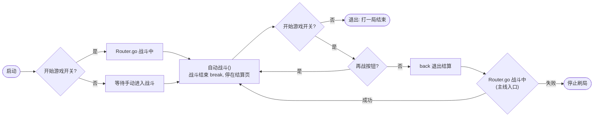
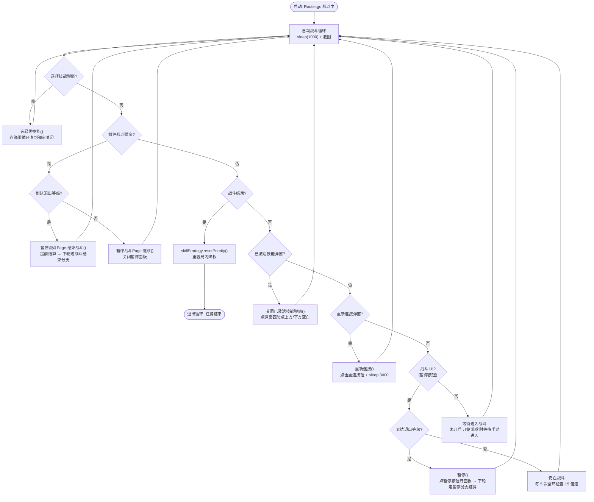

# 战斗中自动战斗状态机

## 刷局循环（main.ts 普通关卡模式）

- "开始游戏"开关统一控制自动开局：首局 + 刷局
- 结算页"再战"按钮直接进战斗（首选）；不可用则退出结算回准备界面走主线关卡入口

## 自动战斗状态机

## 分支顺序依据

弹窗页识别图优先于"战斗中"宽识别（弹窗打开时暂停按钮/技能图标仍可见，"战斗中"模板在选择技能/暂停战斗/战斗结束页也可能匹配）：

| 顺序 | 分支 | 识别图 | 说明 |
|------|------|--------|------|
| 1 | 选择技能弹窗 | `选择技能_0_0.8_...` 标题 | 弹窗专属识别，最先 |
| 2 | 暂停战斗弹窗 | `暂停战斗_1_0.9_...` 文字 | 弹窗专属识别 |
| 3 | 战斗结束 | `战斗结束$_back_...` 右下角 back | **必须在已激活技能之前**：结算页"战斗中"模板可能残留匹配 |
| 4 | 已激活技能弹窗 | `战斗中_已激活技能_0_0.9_...` | 用户实测只在弹窗弹出时出现，点弹窗外空白关闭 |
| 5 | 重新连接弹窗 | `重新连接_1_0.9_...` | 网络波动时出现，点击重连。**在兜底之前**：重连时"战斗中"宽识别（暂停按钮）可能仍匹配 |
| 6 | 兜底 | 暂停按钮 | 战斗中，维护 15 倍速；识别不到战斗 UI（未开启"开始游戏"等待手动进入）时仅等待，不点按钮 |

## 页面注册顺序（daily.ts）

`选择技能 → 暂停战斗 → 战斗结束 → 战斗中`

弹窗页全部在"战斗中"之前注册，保证 Router `detectCurrentPage` 在弹窗打开时优先识别为弹窗页。

## 退出等级

- 配置：`mainWindow 退出等级`（switch+数字输入，`getValue()` 返回 null 表示未启用）
- `到达退出等级()` 判定：
  - 未启用或 ≥99（不提前退出）→ 不退出
  - **等级 1 → 必然到达**（角色开局即 1 级，进去直接退）：战斗中发现暂停按钮 → 点暂停 → 暂停面板分支结束战斗 → 结算 → 刷局循环
  - TODO: 等级 >1 时需读取战斗中当前等级（OCR/模板）与目标比较，暂不支持
